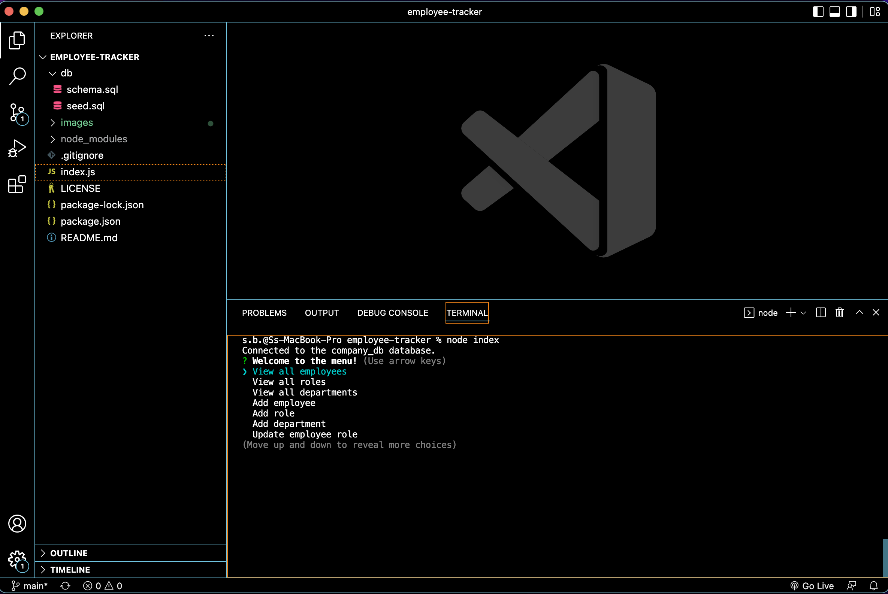

# Employee Tracker 

## License
   

   Please click on the badge to view license info.
   

## Description
This application is a command-line application that manages a company's employee database, using Node.js, Inquirer, and MySQL.

## Table of Contents

- [License](#license)
- [Description](#description)
- [Installation](#installation)
- [Usage](#usage)
- [Visuals](#visuals)
- [Tests](#tests)
- [Contributors](#contributors)
- [Contact](#contact)

## Installation
Please use npm install and node index to use this project.

## Usage
To be used as a Content Management System (CMS) for a business.

## Visuals

Please click on the picture below to be taken to the video demo of the project.

## Tests

None.

## Contributors

Sherreka S. Burton

## Contact

If you have any questions about this project please contact: Sherreka S. Burton

Github: [ssbbgm](http://github.com/ssbbgm)

Email: ssburto825@gmail.com